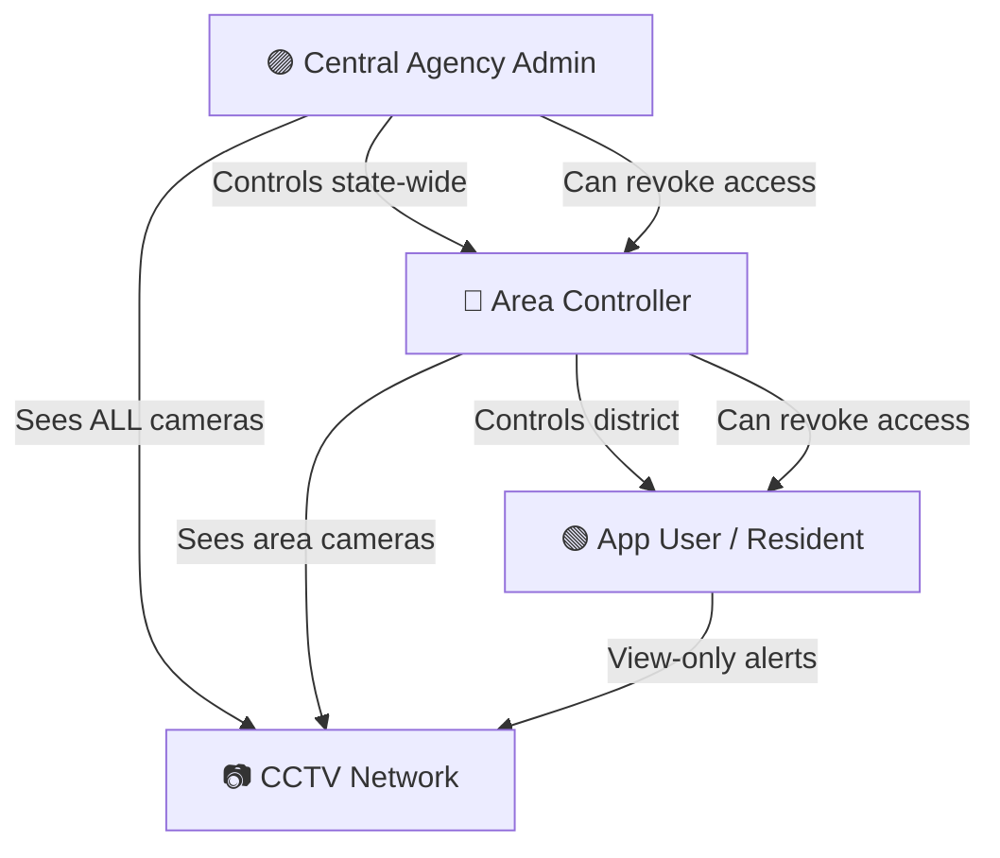
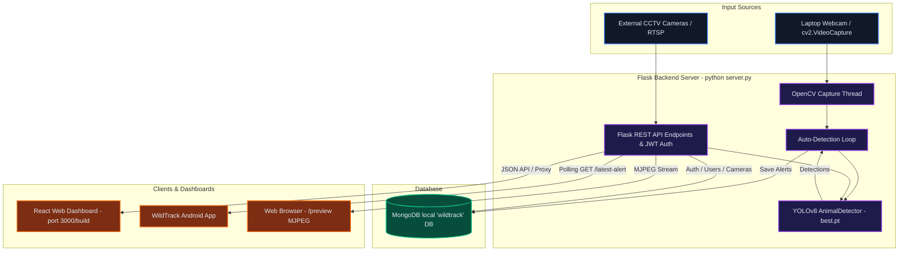

# 🐾 WildTrack: Advanced Wild Animal Alert System

WildTrack is a modern, end-to-end wild animal detection and alert system designed to monitor perimeters, identify dangerous wildlife, and dispatch instant notifications to monitoring dashboards and mobile applications. It integrates a lightweight Flask backend, an OpenCV webcam/CCTV feed ingestion pipeline, a custom-trained YOLOv8 computer vision model, a beautiful React administrative dashboard, and an Android client application.

Recently upgraded, WildTrack now features a **robust three-tier Hierarchical Role-Based Access Control (RBAC)** system designed for state-wide and district-level governance of wildlife security.

---

## 🔐 Hierarchical Command Architecture

WildTrack enforces strict geographic and role-based data isolation mirroring real-world wildlife agency structures:


```mermaid
graph TD
    A["🟣 Central Agency Admin"] -->|"Controls state-wide"| B["🔵 Area Controller"]
    A -->|"Can revoke access"| B
    B -->|"Controls district"| C["🟢 App User / Resident"]
    B -->|"Can revoke access"| C
    
    A -->|"Sees ALL cameras"| D["📷 CCTV Network"]
    B -->|"Sees area cameras"| D
    C -->|"View-only alerts"| D
```

### Role Definitions

| Role | Scope | Dashboard Access | Capabilities |
|------|-------|-----------------|--------------|
| **🟣 Central Agency Admin** | Entire State | Full Access | Manage all state-wide Area Controllers & App Users, full camera network control, server config. |
| **🔵 Area Controller** | Specific District | Management | Manage district-level App Users, monitor district cameras, manage local alerts. |
| **🟢 App User / Resident**| Local Zone | View-Only | View live dashboard, alert history, receive notifications. No management permissions. |

---

## 📸 System Flowchart Overview

### Logical Data Flow
The diagram below details the data flow between physical input sources, the Python Flask backend service, the YOLOv8 model, the MongoDB storage layer, and client user interfaces:


```mermaid
graph TD
    classDef device fill:#111827,stroke:#3b82f6,stroke-width:2px,color:#e2e8f0;
    classDef server fill:#1e1b4b,stroke:#a855f7,stroke-width:2px,color:#e2e8f0;
    classDef db fill:#064e3b,stroke:#10b981,stroke-width:2px,color:#e2e8f0;
    classDef client fill:#7c2d12,stroke:#f97316,stroke-width:2px,color:#e2e8f0;

    subgraph VideoSources [Input Sources]
        webcam[Laptop Webcam / cv2.VideoCapture]:::device
        cctv[External CCTV Cameras / RTSP]:::device
    end

    subgraph Backend [Flask Backend Server - python server.py]
        flask_api[Flask REST API Endpoints & JWT Auth]:::server
        cv_thread[OpenCV Capture Thread]:::server
        det_thread[Auto-Detection Loop]:::server
        yolo[YOLOv8 AnimalDetector - best.pt]:::server
    end

    subgraph Storage [Database]
        mongo[(MongoDB local 'wildtrack' DB)]:::db
    end

    subgraph Viewers [Clients & Dashboards]
        react_dash[React Web Dashboard - port 3000/build]:::client
        android_app[WildTrack Android App]:::client
        live_preview[Web Browser - /preview MJPEG]:::client
    end

    webcam --> cv_thread
    cctv --> flask_api
    cv_thread --> det_thread
    det_thread --> yolo
    yolo -- Detections --> det_thread
    flask_api --> yolo
    det_thread -- Save Alerts --> mongo
    flask_api -- Auth / Users / Cameras --> mongo
    
    flask_api -- MJPEG Stream --> live_preview
    flask_api -- JSON API / Proxy --> react_dash
    flask_api -- Polling GET /latest-alert --> android_app
```

---

## 🗂️ File-by-File Repository Breakdown

### Root Directory Files
*   **`server.py`**: The core execution engine. Written in Flask, it hosts the REST API endpoints, JWT authentication logic, RBAC enforcement, background OpenCV thread, YOLOv8 detection thread, and MongoDB connection.
*   **`requirements.txt`**: List of primary Python library dependencies including Flask, Flask-CORS, Flask-JWT-Extended, OpenCV-python, NumPy, PyMongo, and Bcrypt.
*   **`run_server.bat`**: A Windows batch file launcher that simplifies startup, handles dependency installation, and starts the server.
*   **`fix_model.py`**: Utility to convert PyTorch weights formats into a serialized `.pt` file (`best_fixed.pt`).

### Machine Learning Engine (`ml_models/`)
*   **`detector.py`**: Contains the `AnimalDetector` wrapper class using `ultralytics.YOLO`. Filters low-confidence outputs, translates coordinates, and defines `DANGEROUS_ANIMALS` threat metrics.
*   **`best.pt`**: Custom-trained YOLOv8 weights for animal object classification.

### React Management Dashboard (`dashboard/`)
The web client dashboard is built using React and offers a premium, modern, and dynamic user interface with state-of-the-art micro-animations and color schemes.
*   **`dashboard/src/App.js`**: Main router, auth gatekeeper, and global state manager.
*   **`dashboard/src/components/`**:
    *   `Sidebar.js`: Dynamic, role-filtered navigation sidebar indicating the user's jurisdiction.
    *   `TopBar.js`: Context-aware header displaying page titles and role badges.
    *   `CameraLocationMap.js`: Interactive Google Maps component for pinpointing geographic deployment zones during registration.
*   **`dashboard/src/pages/`**:
    *   `Landing.js`: Premium signup/login portal featuring role-aware registration flows, interactive location mapping, and JWT acquisition.
    *   `Dashboard.js`: Operational command center depicting live analytics, camera statuses, and recent threats. Includes role-based operation controls.
    *   `UsersManagement.js`: Beautiful personnel management table allowing Agency and Area admins to view, search, and revoke access of subordinate personnel.
    *   `Alerts.js`: Historical log of all animal alerts with locations and confidence metrics.
    *   `Cameras.js`: Management view allowing adding, editing, and deleting cameras.
    *   `MultiView.js`: Grid view of all active registered camera feeds.
    *   `CctvSetup.js`, `AndroidGuide.js`, `ServerConfig.js`, `Settings.js`: Documentation and configuration modules.

---

## ⚙️ How the System Operates

### 1. Security & Authentication
*   Users register via the `Landing.js` interface, providing role-specific geographic data (Country/State for Agency Admin, down to Map Coordinates for Area Controllers).
*   `server.py` hashes passwords with `bcrypt` and stores personnel in MongoDB.
*   Login issues a JWT containing the user's identity, role, and geographic jurisdiction.
*   All sensitive API routes (`/api/users`, `/api/cameras`, etc.) enforce `@jwt_required()` and execute strict boundary checks ensuring users can only interact with data inside their jurisdiction.

### 2. Video Capture & ML Inference
*   Daemon thread (`_webcam_thread()`) captures frames via OpenCV (webcam or RTSP).
*   Auto-detection thread (`_auto_detect_loop()`) processes frames through YOLOv8 every 2 seconds.
*   Detected threats are encoded (Base64), stored in MongoDB (`alerts` collection), and pushed to the global `latest_alert` state.

### 3. React Web Interface
The React App acts as the primary command center. Based on the JWT role, the interface dynamically reconfigures itself to expose or hide features (e.g., App Users cannot see the Personnel Management page).

### 4. WildTrack Android Mobile Client
*   Polls `GET /latest-alert` continuously.
*   Triggers high-priority audible alerts and visual notifications upon dangerous animal detection.
*   Decodes Base64 payloads to display the exact frame containing the threat.

---

## 🚦 API Reference

| Endpoint                  | Method | Description                                                                 | Auth Needed |
|---------------------------|--------|-----------------------------------------------------------------------------|-------------|
| `/api/auth/register`      | `POST` | Registers new users with Role and Geographic Jurisdiction parameters.       | No          |
| `/api/auth/login`         | `POST` | Authenticates and returns JWT `access_token`.                               | No          |
| `/api/users`              | `GET`  | Returns subordinate personnel scoped to caller's role/jurisdiction.         | Yes         |
| `/api/users/<email>`      | `DEL`  | Revokes access for a subordinate user, verifying state/district boundaries. | Yes         |
| `/api/cameras`            | `GET/POST` | Manages camera registries.                                              | Yes         |
| `/latest-alert`           | `GET`  | Retreives current active alert and Base64 frame for mobile apps.            | Optional    |
| `/camera/detect`          | `POST` | Endpoint for external CCTV cameras to push frames for inference.            | No          |
| `/video_feed`             | `GET`  | Standard MJPEG video feed for dashboard streaming.                          | No          |

---

## 🛠️ Step-by-Step Installation

### System Pre-requisites
*   Python 3.8 to 3.11 installed.
*   MongoDB installed and running locally on port 27017.
*   Node.js and npm (For compiling/running React frontend).

### 1. Server Setup
Initialize python requirements:
```bash
pip install -r requirements.txt
```
*Alternatively, double click the launcher script **`run_server.bat`** which automatically handles dependencies and starts the server.*

### 2. Deploying React Frontend
In a separate terminal tab:
```bash
cd dashboard
npm install
npm run build
npm start
```

### 3. Running the System
Once started, the backend API runs on `http://localhost:5000` and the React frontend on `http://localhost:3000`. Navigate to the React app to register your first **Central Agency Admin** account to begin configuring the network!
